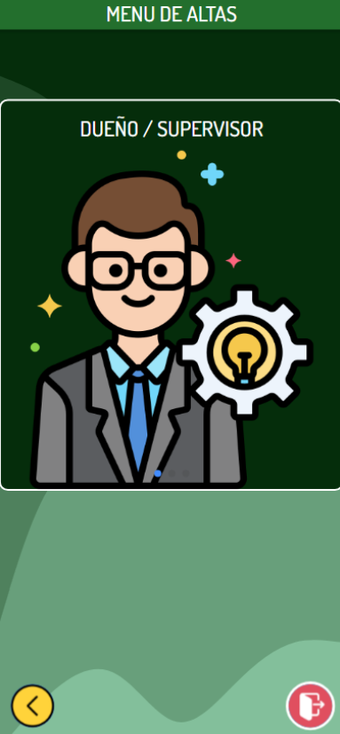

# krud-2023

**SEMANA 1: 27/5 - 3/6**

| Estado |                    Tarea                     |       Encargado        |
|--------|----------------------------------------------|------------------------|
|   ✔️  | Splash animado                               | Sein Ian                |
|   ✔️  | Splash estatico                              | Cisternas Celeste       |
|   ✔️  | Icono                                        | Cisternas Celeste       |
|   ✔️  | Login                                        | Sein Ian                |
|   ✔️  | Alta dueño/supervisor                        | Cisternas Celeste       |
|   ✔️  | Alta empleados                               | Sein Ian                |
|   ✔️  | Alta clientes                                | Sein Ian                |

**SEMANA 2: 3/6 - 10/6**

| Estado |                    Tarea                     |       Encargado        |
|--------|----------------------------------------------|------------------------|
|   ✔️  | Alta mesa                                    | Cisternas Celeste       |
|   ✔️  | Alta productos                               | Sein Ian                |
|   ✔️  | Qr ingreso local                             | Sein Ian                |
|   ✔️  | Qr mesa                                      | Cisternas celeste       |
|   ✔️  | Qr propina                                   | Cisternas Celeste       |
|   ✔️  | Encuesta clientes                            | Cisternas Celeste       |
|   ✔️  | Encuesta empleados                           | Sein Ian                |
|   ✔️  | Encuesta supervisor                          | Sein Ian                |

**SEMANA 3: 10/6 - 17/6**

| Estado |                    Tarea                     |       Encargado        |
|--------|----------------------------------------------|------------------------|
|   ✔️  | Gestion registro clientes                    | Sein Ian                |
|   ✔️  | Gestion ingreso al local                     | Cisternas Celeste       |
|   ✔️  | Gestion realizar pedidos                     | Sein Ian                |
|   ✔️  | Gestion confirmar pedidos                    | Cisternas Celeste       |
|   ✔️  | Push agregar clientes nuevos                 | Cisternas Celeste       |
|   ✔️  | Push ingreso al local                        | Sein Ian                |
|   ✔️  | Push consultar al mozo                       | Cisternas Celeste       |

**SEMANA 4: 17/6 - 24/6**

| Estado |                    Tarea                     |       Encargado        |
|--------|----------------------------------------------|------------------------|
|   ✔️  | Push confirmar pedido                        | Sein Ian                |
|   ✔️  | Push confirmar realizacion del pedido        | Cisternas Celeste       |
|   ✔️  | Juegos 10% descuento                         | Sein Ian                |
|   ✔️  | Juegos 15% descuento                         | Cisternas Celeste       |
|   ✔️  | Juegos 20% descuento                         | Cisternas Celeste       |

**SEMANA 5: 24/6 - 1/7**
| Estado |                    Tarea                     |       Encargado        |
|--------|----------------------------------------------|------------------------|
|   ✔️  | Alta empleados                               | Sein Ian                |
|   ✔️  | Alta mesa                                    | Cisternas Celeste       |
|   ✔️  | Reservas                                     | Sein Ian                |
|   ✔️  | Alta productos cocinero/bartender            | Cisternas Celeste       |
|   ✔️  | Login con Google                             | Cisternas Celeste       |

------------------------------------------------------------------------------

# RECORRIDO DEL CLIENTE EN LA APLICACION

### Cuando se ingresa a la aplicación, el usuario tiene la posibilidad de iniciar sesión si ya está registrado, crear una cuenta como cliente habitual o, en su lugar, optar por ser un cliente anónimo.
  

____________________________________________________________________________________________________________________________________________________________________________________________________________
### Luego el cliente tendra la opcion de realizar una reserva o escanear un código QR que lo ingresará al local donde podra ingresar a la lista de espera. En caso de ser admitido y recibir una asignación de mesa, deberá escanear únicamente el código QR correspondiente a esa mesa, sin tener la capacidad de escanear ningún otro.
    

____________________________________________________________________________________________________________________________________________________________________________________________________________
### Al escanear el QR de la mesa se le desplegara un menu de opciones donde podra realizar el pedido y hacerle consultas al mozo.
     

____________________________________________________________________________________________________________________________________________________________________________________________________________
### Despues de realizar el pedido el cliente tiene la opcion de verificar el estado del pedido para saber en que instancia se encuentra este. Tendra la opcion de jugar los juegos de: "Ahorcado" (Por un 10% de descuento), "Mayor o Menor" (por un 15% de descuento) o "Buscaminas" (por un 20% de descuento). Luego de que el pedido este terminado, el cliente debe confirmar la recepcion del mismo para poder acceder a pagar la cuenta.

       

____________________________________________________________________________________________________________________________________________________________________________________________________________
### Al momento de pedir la cuenta el cliente visualizara todos los importes por separado y el total. Ademas tiene la opcion de escanear un codigo QR para dejar propina. Luego de que el cliente realize el pago debera esperar que el mozo lo confirme. Luego el cliente podra realizar una encuesta de satisfaccion.

     
 
____________________________________________________________________________________________________________________________________________________________________________________________________________

# VISTAS DE LOS EMPLEADOS

## MOZO
### Confirma el pedido del cliente y se lo asigna al cocinero y al bartender. Le lleva el pedido terminado al cliente. Puede entrar a un chat con el cliente. Luego de que el cliente pague, el mozo debera confirmar el pago.
   

____________________________________________________________________________________________________________________________________________________________________________________________________________
## METRE
### Le asigna una mesa al cliente.

____________________________________________________________________________________________________________________________________________________________________________________________________________
## COCINERO
### Realiza el pedido que es enviado por el mozo. Puede agregar nuevos productos al menú.

  

____________________________________________________________________________________________________________________________________________________________________________________________________________
## BARTENDER
### Realiza el pedido que es enviado por el mozo. Puede agregar nuevos productos al menú.

  

____________________________________________________________________________________________________________________________________________________________________________________________________________
## SUPERVISOR/DUEÑO
### Gestiona la habilitacion/deshabilitacion de clientes para que puedan ingresar o no a la pagina. Puede dar de alta a un Supervisor/Dueño, Empleados, Mesas. Tiene acceso para ver las encuestas realizadas de los empleados y clientes.

     

____________________________________________________________________________________________________________________________________________________________________________________________________________
## QRS
# INGRESO AL LOCAL

# MESA 1

# MESA 2

# MESA 3

# MESA 4

# PROPINA

